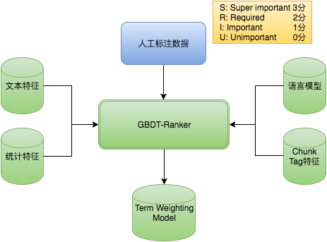

# wordrank
[](https://badge.fury.io/py/wordrank)
[](CONTRIBUTING.md)
[](https://github.com/shibing624/wordrank/graphs/contributors)
[](LICENSE)
[](requirements.txt)
[](https://github.com/shibing624/wordrank/issues)
[](#Contact)

Word Rank(term weighting), calculate context-aware bag-of-words term weights for documents and queries.

**wordrank**基于特征工程的词重要度分析工具，支持词权重打分、词干提取等query分析，扩展性强，开箱即用。


**Guide**

- [Feature](#Feature)
- [Install](#install)
- [Usage](#usage)
- [Contact](#Contact)
- [Cite](#Cite)
- [Reference](#reference)

# Feature

如何计算query中各word的权重呢？
## 思路
### 特征工程的解决思路
1. 实现时采用模型打分方法，以搜索query为原始语料，人工标注句子中各词重要度

> 重要度共分4级：
> * Super important：主要包括POI核心词，比如“方特、欢乐谷”
> * Required：包括行政区词、品类词等，比如“北京 温泉”中“北京”和“温泉”都很重要
> * Important：包括品类词、门票等，比如“顺景 温泉”中“温泉”相对没有那么重要，用户搜“顺景”大部分都是温泉的需求
> * Unimportant：包括语气词、代词、泛需求词、停用词等

上例中可见“温泉”在不同的query中重要度是不同的。

2. 模型方面采用树模型（XGBoost等）进行训练，得到权重分类模型后在线上预测


### 深度模型的解决思路
* 利用深度学习模型来学习term重要性，比如通过训练基于BiLSTM+Attention的query意图分类模型
* 基于Seq2Seq/Transformer训练的query翻译改写模型得到的attention权重副产物再结合其他策略或作为上述分类回归模型的特征也可以用于衡量term的重要性
* 利用BERT模型训练端到端的词分级模型，类似序列标注模型，后接CRF判定词重要性权重输出


## 解决方法
### 特征方法
* 文本特征：包括Query长度、Term长度，Term在Query中的偏移量，term词性、长度信息、term数目、位置信息、句法依存tag、是否数字、是否英文、是否停用词、是否专名实体、是否重要行业词、embedding模长、删词差异度、以及短语生成树得到term权重等
* 统计特征：包括PMI、IDF、textrank值、前后词互信息、左右邻熵、独立检索占比（term单独作为query的qv/所有包含term的query的qv和）、统计概率、idf变种iqf
* 语言模型特征：整个query的语言模型概率 / 去掉该Term后的Query的语言模型概率

### 深度模型
* BERT CLS + classification
* Seq2Seq + Attention

# Install
* 全自动安装：
```shell
pip3 install -U wordrank
```
* 半自动安装：
```shell
git clone https://github.com/shibing624/wordrank.git
cd wordrank
python3 setup.py install
```


### 依赖库

```shell
pip3 install text2vec pycorrector
```
主要包括以下Python包：
* [text2vec](https://github.com/shibing624/text2vec)
* [pycorrector](https://github.com/shibing624/pycorrector)

### 依赖数据

* SentenceBERT模型[sentence-transformers/paraphrase-multilingual-MiniLM-L12-v2](https://huggingface.co/sentence-transformers/paraphrase-multilingual-MiniLM-L12-v2) ，模型由transformers库自动下载于：~/.cache/huggingface/transformers/ 下。
* 千兆中文文本训练的语言模型[zh_giga.no_cna_cmn.prune01244.klm(2.8G)](https://deepspeech.bj.bcebos.com/zh_lm/zh_giga.no_cna_cmn.prune01244.klm)，模型由pycorrector库自动下载于：~/.pycorrector/datasets/zh_giga.no_cna_cmn.prune01244.klm 。

# Usage

```python
import wordrank

q = '哪里下载电视剧周恩来？'
r = wordrank.rank(q)
print(r)
```

output:
```shell
[('哪里', '1'), ('下载', '3'), ('电视剧', '3'), ('周恩来', '1'), ('？', 0)]
```
> 3：核心词；2：限定词；1：可省略词；0：干扰词。


### 命令行

使用示例： python -m wordrank

预测文本`井冈山景点介绍`的词重要度

命令行选项（训练领域模型）：
```
使用: python -m wordrank --train

如果没有指定训练文件，则使用默认训练样本`extra_data/train.csv`。
```


`--help`选项输出：
```shell
$> python -m wordrank --help

usage: __main__.py [-h] [--train] [--train_file TRAIN_FILE]
                   [--col_sep COL_SEP] [--segment_sep SEGMENT_SEP]
                   [--stopwords_path STOPWORDS_PATH]
                   [--person_name_path PERSON_NAME_PATH]
                   [--place_name_path PLACE_NAME_PATH]
                   [--common_char_path COMMON_CHAR_PATH]
                   [--domain_sample_path DOMAIN_SAMPLE_PATH] [--ngram NGRAM]
                   [--pmi_path PMI_PATH] [--entropy_path ENTROPY_PATH]
                   [--model_path MODEL_PATH] [--query QUERY]

optional arguments:
  -h, --help            show this help message and exit
  --train               train or predict
  --train_file TRAIN_FILE
                        train file, file encode utf-8.
  --col_sep COL_SEP     column sep
  --segment_sep SEGMENT_SEP
                        segment_sep
  --stopwords_path STOPWORDS_PATH
                        stop word file
  --person_name_path PERSON_NAME_PATH
                        person name file
  --place_name_path PLACE_NAME_PATH
                        place name file
  --common_char_path COMMON_CHAR_PATH
                        common_char_path
  --domain_sample_path DOMAIN_SAMPLE_PATH
                        domain_sample_path
  --ngram NGRAM         common_char_path
  --pmi_path PMI_PATH   pmi_path
  --entropy_path ENTROPY_PATH
                        entropy_path
  --model_path MODEL_PATH
                        model file path to save
  --query QUERY         input query

```

### 延迟加载机制

wordrank 采用延迟加载，`import wordrank` 和 `from wordrank import WordRank` 不会立即触发词典及模型的加载，一旦有必要才开始加载词典。
如果你想手工初始`wordrank`，也可以手动初始化。
```python
from wordrank import WordRank
model = WordRank()
model.check_inited()  # 手动初始化（可选）
```

你可以改变主模型的路径:
```python
from wordrank import WordRank
model = WordRank(model_path='/your/model/path')
model.check_inited()
```


# Contact

- Issue(建议)：[](https://github.com/shibing624/wordrank/issues)
- 邮件我：xuming: xuming624@qq.com
- 微信我：加我*微信号：xuming624*, 进Python-NLP交流群，备注：*姓名-公司名-NLP*


# Cite

如果你在研究中使用了wordrank，请按如下格式引用：

```latex
@software{wordrank,
  author = {Xu Ming},
  title = {wordrank: A Tool for query term weighting},
  year = {2021},
  url = {https://github.com/shibing624/wordrank},
}
```

# License


授权协议为 [The Apache License 2.0](LICENSE)，可免费用做商业用途。请在产品说明中附加wordrank的链接和授权协议。


# Contribute
项目代码还很粗糙，如果大家对代码有所改进，欢迎提交回本项目，在提交之前，注意以下两点：

 - 在`tests`添加相应的单元测试
 - 使用`python setup.py test`来运行所有单元测试，确保所有单测都是通过的

之后即可提交PR。


# Reference

- [Context-Aware Document Term Weighting for Ad-Hoc Search](http://www.cs.cmu.edu/~zhuyund/papers/TheWebConf_2020_Dai.pdf)
- [term weighting](https://zhuanlan.zhihu.com/p/90957854)
- [DeepCT](https://github.com/AdeDZY/DeepCT)
